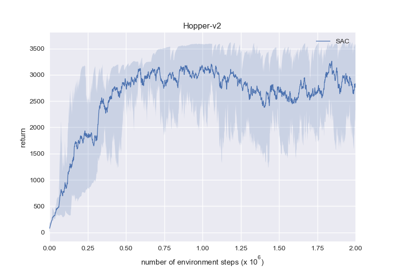
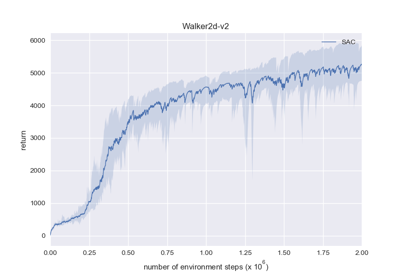
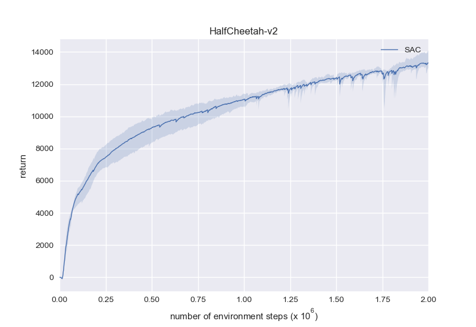
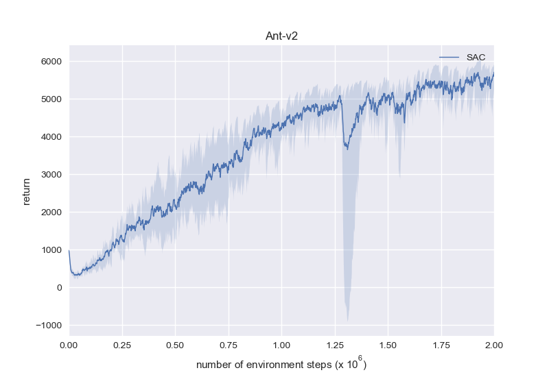
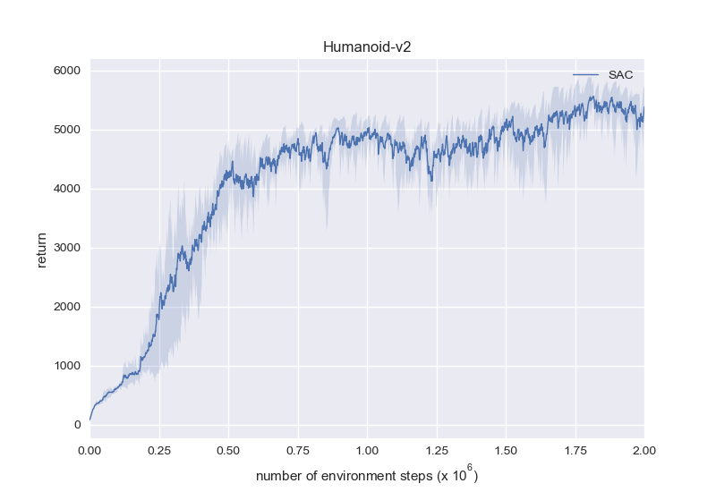
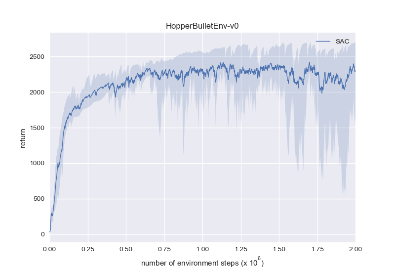
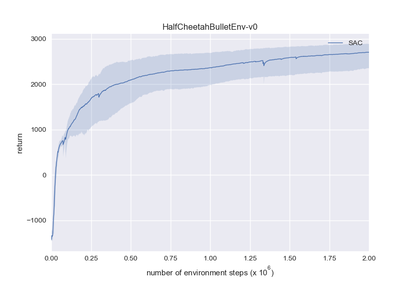
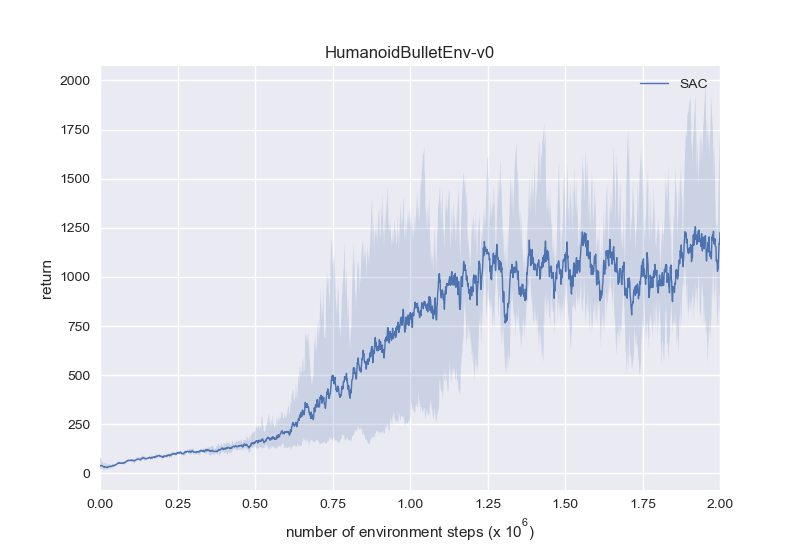

# SimplySAC: A Minimal Soft-Actor-Critic PyTorch Implementation

SimplySAC replicates SAC with minimum (~200) lines of code in clean, readable PyTorch style, while trying to use as few additional tricks and hyper-parameters as possible.

## Implementation details:
* The actor's log_std output is clamped to lie within [-20, 2] according to the authors' source code.
* Before learning, the replay buffer is warmed up with 1e4 transitions collected using an uniformly random policy.
* The Q-value in the actor's loss averages from two critics.

That's it! All other things follow the original paper and pseudo code.

Also check out [SimplyPPO](https://github.com/arthur-x/SimplyPPO), a minimal Proximal-Policy-Optimization PyTorch implementation.

## MuJoCo benchmarks:











Same as the figures in the original paper, these figures are produced with:

* One evaluation episode every 1e3 steps.
* 5 random seeds, where the mean return is represented by the solid line, and max/min return by the shaded area.

To execute a single run:
```
python learn.py -g [gpu_id] -e [env_id] -l [log_id]
```

## PyBullet benchmarks:









Note that the PyBullet versions of the locomotion environments are harder than the MuJoCo versions.

Experiments use `torch==1.7.1`, `mujoco-py==1.50.1.68`, `pybullet==3.0.8`.
