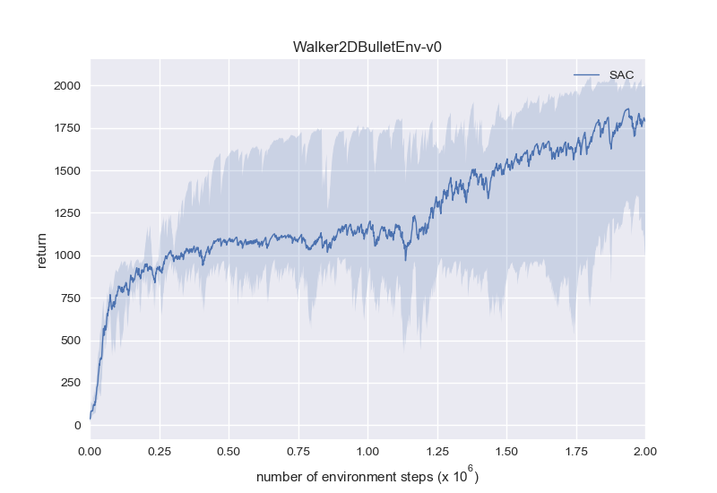
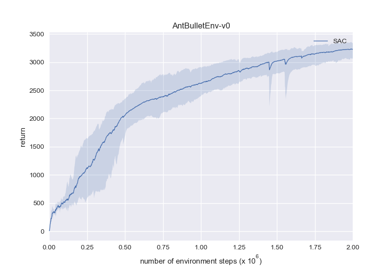

# SimplySAC: A Minimal Soft-Actor-Critic PyTorch Implementation

SimplySAC replicates SAC with minimum (~200) lines of code in clean, readable PyTorch style, while trying to use as few additional tricks and hyper-parameters as possible.

## Implementation details:
<li>
The actor's log_std output is clamped to lie within [-20, 2] according to the authors' source code.
</li>
<li>
Before learning, the replay buffer is warmed up with 1e4 transitions collected using an uniformly random policy.
</li>
<li>
The Q-value in the actor's loss averages from two critics.
</li>
<br>
That's it! All other things follow the original paper and pseudo code.

## MuJoCo benchmarks:


Same as the figures in the original paper, these figures are produced with:
<li>
One evaluation episode every 1e3 steps.
</li>
<li>
5 random seeds, where the mean return is represented by the solid line, and max/min return by the shaded area.
</li>
<br>

To execute a single run:
```
python learn.py -g [gpu_id] -e [env_id] -l [seed_id]
```

## PyBullet benchmarks:








Note that the PyBullet versions of the locomotion environments are harder than the MuJoCo versions.
